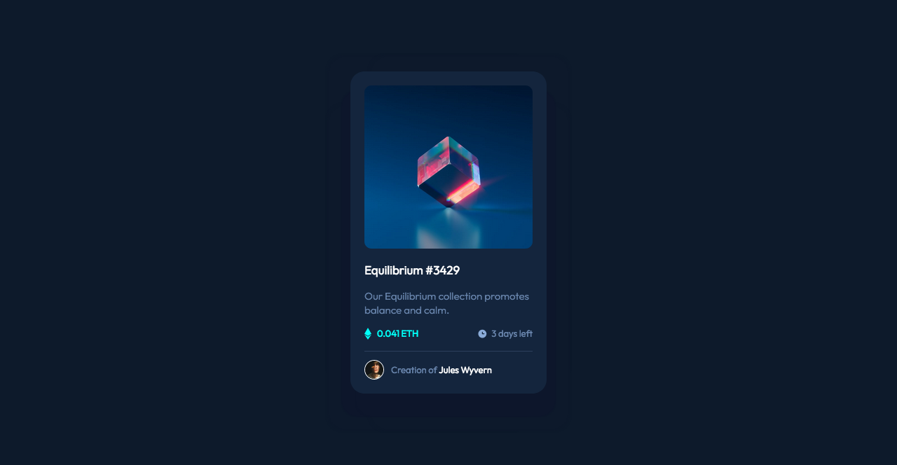

# Frontend Mentor - NFT preview card component solution

This is a solution to the [NFT preview card component challenge on Frontend Mentor](https://www.frontendmentor.io/challenges/nft-preview-card-component-SbdUL_w0U). Frontend Mentor challenges help you improve your coding skills by building realistic projects. 

## Table of contents

- [Overview](#overview)
  - [The challenge](#the-challenge)
  - [Screenshot](#screenshot)
  - [Links](#links)
- [My process](#my-process)
  - [Built with](#built-with)
  - [Continued development](#continued-development)
- [Author](#author)

## Overview

### The challenge

Users should be able to:

- View the optimal layout depending on their device's screen size
- See hover states for interactive elements

### Screenshot

### Links

- Solution URL: [My solution URL](https://github.com/kenzo-wegher/nft-preview-card-component)
- Live Site URL: [Live site URL](https://kenzo-wegher.github.io/nft-preview-card-component/)

## My process

### Built with

- Semantic HTML5 markup
- CSS custom properties
- Flexbox
- CSS Grid
- Sass / SCSS

### Continued development

I've tried to get as close as I could to the original box-shadow.
Likewise, I've tried for a long time to get the same effect on the nft-image:hover, but I couldn't get the same level of brightness of the eye-image's white.

## Author

- Frontend Mentor - [@kenzo-wegher](https://www.frontendmentor.io/profile/kenzo-wegher)
